# Contrato — Concursos CPH

> Fuente de verdad del módulo de **seguimiento de concursos CPH** (Carrera
> Profesional Hospitalaria): etapas del proceso, sorteo de jurado, orden de
> mérito, reutilización de jurados y órdenes de mérito, autorizaciones,
> etiquetas y estados. Todo código que cree o modifique concursos CPH debe
> respetar estas reglas.
>
> Ruta frontend: `/concursos/cph` (lista con pestañas) y
> `/concursos/cph/:id/wizard` (seguimiento por etapas).
> Backend: `apps/api/src/modules/concursos-cph/` bajo `/api/v1/concursos-cph`.

---

## 1. Estados y sub-estados

### 1.1 Estado del concurso (`ConcursoCph.estado`)

Calculado por `calcConcursoCph` (`concursosCph.calc.ts`) en cada write. Valores:
`no_iniciado`, `activo`, `finalizado`, `suspendido`.

Reglas (`calcEstadoBase` + flag `suspendido`):

- `suspendido = true` → **estado `suspendido`** (el flag manda sobre todo).
- Hay `resolucionDesignacion` → `finalizado`.
- **Hay `eeConcurso` (Expediente de Concurso) → `activo`.**
  > Basta con tener el Expediente de Concurso cargado. NO se exige eeBaja ni
  > fechaBaja: los concursos por cargo nuevo no tienen baja.
- Si no, `no_iniciado`.

### 1.2 Semáforo (frontend) y filtro por estado — coherencia obligatoria

El semáforo de la lista y el filtro por estado deben coincidir. El flag
`suspendido` tiene prioridad:

| Semáforo                | Condición                                            |
| ----------------------- | ---------------------------------------------------- |
| 🟢 verde (Activo)       | `estado='activo'` y `suspendido=false`               |
| 🔴 rojo (Suspendido)    | `suspendido=true` (sin importar el estado calculado) |
| 🟠 naranja (Finalizado) | `estado='finalizado'` y `suspendido=false`           |
| ⚪ gris (No iniciado)   | `estado='no_iniciado'` y `suspendido=false`          |

Filtro backend (`listConcursosCphService`): `estado='suspendido'` trae todo lo
que tenga `suspendido=true`; los demás estados exigen `suspendido=false`. Nunca
se mezclan (p.ej. un `Q-DESIERTO` con `estado='activo'` pero `suspendido=true`
cae en "suspendido", no en "activo").

### 1.3 Sub-estado (`subEstado`) — avance por letra

`calcSubEstado` deriva el sub-estado de los campos/fechas presentes: VACANTE /
NO INICIADO → A-CARATULADO → A-AUTZN → B-SORTEO JUR → C-DISPO DE LLAMADO →
C2-INSCRIPCION EX → D-EXAMEN PUBLICADO → E-ORDEN DE MERITO → F-IFACS → G-INSAL →
H-TAD → I-CARGA DOCU → J-APTO MED → K-ITE → L-PYCTO DE RESO → M-RESO A LA FIRMA →
N-DESIGNADO → O-ALTA SIAL; Q-DESIERTO es indicador aparte.

### 1.4 `validado` — flag INDEPENDIENTE (no es sub-estado)

`ConcursoCph.validado` (Boolean, + `validadoAt`, `validadoIdSialRol`) es una
**dimensión ortogonal** al sub-estado del flujo. Indica que el cargo ya apareció
en el padrón semanal triangulado con este concurso (misma persona por CUIL,
misma carrera/escalafón, misma especialidad).

**Regla clave**: un concurso puede estar `validado` **aunque le falten pasos de
la Etapa 5** (documentación, apto médico, ITE, resolución). Ejemplo real: el
padrón ya trae el cargo nuevo, pero el operador todavía no cargó la
documentación pendiente → el concurso está **validado (verde)** y a la vez su
sub-estado sigue en, p.ej., `I-CARGA DOCU`. Por eso `validado` **NO** entra en
`calcSubEstado` ni desplaza el avance por letra.

---

## 2. Etapas del wizard (5 etapas, NO 6)

El concurso tiene **5 etapas**. "Declarar desierto" **NO es una etapa**: es una
acción que relanza el concurso desde la Etapa 1.

1. **Baja / Apertura** — datos de la baja (readonly) + Expediente de Concurso,
   Sigla, Escalafón, Puesto, Especialidad e **IF de autorización**.
2. **Autorización / Jurado** — autorización DGAYDRH/SGRASV, sorteo de jurado y
   disposición de llamado.
3. **Inscripción / Examen / OM** — inscriptos, cierre de inscripción, examen,
   presentados y orden de mérito.
4. **IFACS / INSAL** — IFACS, reserva del candidato del orden de mérito
   (por inscripto, sin tocar el padrón) e INSAL (ver §6bis).
5. **Designación** — pasos TAD/documentación/apto médico/ITE/resolución/Cargo
   SIAL con botón "Registrar" por paso, más el panel de estado de la persona
   contra el padrón (ver §6ter).

Mapeo sub-estado → etapa (columna "Etapa" / stepper de la lista):

- Etapa 1: VACANTE, NO INICIADO, A-CARATULADO
- Etapa 2: A-AUTZN, B-SORTEO JUR, C-DISPO DE LLAMADO
- Etapa 3: C2-INSCRIPCION EX, D-EXAMEN PUBLICADO, E-ORDEN DE MERITO
- Etapa 4: F-IFACS, G-INSAL
- Etapa 5: H-TAD … O-ALTA SIAL (y Q-DESIERTO)

Al cambiar de etapa en el wizard, el scroll sube al tope automáticamente.

---

## 3. IF de autorización y flujo de apertura (Etapa 1 → autorización SGRASV)

- Campo `ConcursoCph.ifAutorizacion` (string, nullable) — nro de documento IF.
- En la Etapa 1, con el **Expediente de Concurso** cargado y **sin autorización
  en curso**, se puede: completar el IF y **reservar un candidato de una OM
  compatible** (ver §6).
- **Gatillo de autorización** (`patchConcursoCphService`): al cargar el
  `eeConcurso` por primera vez **con `ifAutorizacion` presente**, se solicita la
  autorización a **SGRASV** (`pendienteAutorizacion=true`, solo sgrasv). Sin IF,
  solo se genera una notificación informativa.
- **Al autorizar SGRASV** (`aprobarAutorizacionCphService`, paso sgrasv aprobado):
  - Si hay **candidato de OM reservado** para el concurso → se **arrastran** del
    concurso de origen de esa OM: `fechaAutorizacion`, `sorteoJurado`,
    `disposicion`, `fechaInscDesde`, `fechaInscHasta`, `inscripcionCerrada`,
    `fechaExamen`, `fechaOrdenMerito`, `presentadosConfirmados`,
    `ordenMeritoConfirmado`; se recalcula y el concurso **salta a la Etapa 4**
    (IFACS/INSAL). No se copia IFACS/INSAL (son propios del nuevo concurso).
  - Si **no hay candidato reservado** → flujo normal a la **Etapa 2**.

> El salto de etapas ocurre **al autorizar**, no al reservar el candidato: si
> SGRASV no autoriza, no se avanza.

---

## 4. Sorteo de jurado (Etapa 2)

Servicio: `sorteoJurado.service.ts`. Un `SorteoJurado` (acta) + N
`MiembroJuradoSorteado`. `fechaSorteo` = día de generación; se confirma aparte.

### 4.1 Padrón de elegibles

Ocupaciones activas (`hasta=null`) cuyo cargo pertenece al **mismo escalafón**
del cargo a concursar (misma profesión), persona activa, excluyendo la persona
de la baja y la designada. Conducción = `codigoJefaturas` no vacío/no '0'.

### 4.2 Reglas en cascada

- **Regla 1**: mismo hospital + conducción + misma especialidad.
- **Regla 2**: mismo hospital + antigüedad ≥ mínima (especialidad opcional).
- **Regla 3**: sistema (cualquier hospital) + conducción.

La cascada acumula por regla hasta alcanzar el total (titulares+suplentes),
agregando el nivel completo de cada regla.

### 4.3 Selección con PRIORIDAD por regla (no azar plano)

`sortearJurado` **prioriza por regla**: llena primero con Regla 1, luego 2,
luego 3. Dentro de cada regla, **primero los que cumplen especialidad**; entre
iguales, orden aleatorio sembrado (auditable). Solo se baja de regla para
completar cupos faltantes.

> Antes se barajaba todo el pool por igual, así que pocos candidatos de Regla 1
> casi nunca salían por azar. Ahora los más idóneos entran primero.

### 4.4 Match de especialidad (ignora paréntesis)

`norm()` normaliza especialidades para comparar: sin acentos, minúsculas,
**se descarta lo que está entre paréntesis** y se colapsan espacios. Motivo: los
cargos legacy guardan `Clinica Medica (Medicina Interna)` mientras el padrón usa
`Clínica Médica`. **No se modifican datos, solo la comparación.** Para el jurado
importa la especialidad base; la distinción del paréntesis no interesa (ver
`Doc/DATA_CLEANING_ESPECIALIDADES.md`).

### 4.5 Jurados vigentes y reutilización

- **Vigencia**: 6 meses desde `fechaSorteo`, confirmado.
- `GET /jurados-vigentes` devuelve TODAS las actas confirmadas con flag
  `vigente` (fechaSorteo dentro de 6 meses). La pestaña "Jurados" es una tabla
  con búsqueda, filtro por especialidad y filtro Activos/Inactivos/Todos.
- **Reutilizar** (`POST /:id/jurado/reutilizar`): copia los miembros de un acta
  confirmada y **vigente** a una nueva acta borrador del concurso destino,
  validando **mismo escalafón + especialidad** y que el destino no tenga acta
  confirmada. Un jurado vencido NO se puede reutilizar.

---

## 5. Orden de mérito (Etapa 3) — modelo reutilizable

Modelos: `OrdenMerito` + `OrdenMeritoIntegrante`. El flujo operativo (inscriptos
con `presentoExamen`/`ordenMerito`) alimenta el documento reutilizable al
confirmar.

- **Al confirmar OM** (`confirmarOrdenMeritoService`): crea `OrdenMerito`
  (`especialidad`, `puesto`, `fechaPublicacion`=hoy, `fechaVencimiento`=+6 meses,
  `estado='vigente'`) + `OrdenMeritoIntegrante` desde los inscriptos presentados
  (posición = `ordenMerito`). Idempotente (reemplaza la OM previa del concurso).
- **Revertir OM**: bloqueado si algún integrante ya fue designado por otro
  concurso; si no, elimina el documento.
- **Vigencia**: 6 meses (+ prórroga opcional de 60 días vía `fechaProrroga`), o
  hasta que todos los integrantes estén designados/anulados.
- `OrdenMeritoIntegrante`: `designado` (Boolean) + `concursoCphDesignadoId` (qué
  concurso lo tomó) + **`anulado`** (Boolean) + `motivoAnulado` (no aceptó el
  cargo). Un integrante está **disponible** si `!designado && !anulado`.
- `GET /ordenes-merito-vigentes`: OM vigentes con ≥1 integrante disponible +
  contador `disponibles`. Pestaña "Órdenes de mérito" = tabla con búsqueda y
  filtro por especialidad.

---

## 6. Reutilización de OM y reelección (Etapa 1)

- **Compatibilidad de OM**: mismo **puesto + especialidad + escalafón** que el
  concurso destino.
- **Reservar** (`POST /:id/om/reservar`): toma un integrante disponible de una
  OM compatible vigente → `designado=true`, `concursoCphDesignadoId=destino`, y
  lo registra como `personaDesignada` del destino **si tiene `personaId`**. NO
  finaliza el concurso.
- **Rechazar / no aceptó** (`POST /:id/om/rechazar`): marca el integrante
  `anulado=true` (+ motivo), libera la reserva y limpia la persona designada;
  devuelve `disponiblesRestantes`. Si quedan disponibles → reelegir otro; si no
  → declarar desierto.
- **Liberar** (`POST /:id/om/liberar`): revierte la reserva sin anular.
- `GET /:id/om-compatibles` y `GET /:id/candidato-om` alimentan el panel
  `PanelReutilizarOm`, visible **solo en la Etapa 1** con `eeConcurso` cargado y
  sin autorización en curso. (Se quitó de la Etapa 4: ahí la elección del
  ganador se hace con la reserva por inscripto, ver §6bis.)

> **Reservar/designar de la OM ≠ terminación del concurso.** Solo marca al
> candidato. La validación real ocurre cuando el CUIL aparece en el padrón
> semanal triangulado con el concurso (ver §6ter y §6qua).

---

## 6bis. Etapa 4 — Reserva del ganador (INSAL) sin tocar el padrón

En la Etapa 4 se elige a quién notificar por INSAL **sin resolver contra el
padrón** (un ganador de concurso puede no existir todavía como agente en SIAL).

- Campo `ConcursoCph.inscriptoReservadoId` (FK a `InscriptoConcurso`,
  `onDelete: SetNull`). Apunta al **inscripto del orden de mérito**, NO al padrón
  de personas. La designación oficial contra el padrón es la Etapa 5.
- **Elegir candidato** (modal, modo `proponer`): lista los elegibles del orden
  de mérito de ESTE concurso (`presentoExamen`, con `ordenMerito`, excluyendo los
  de `insalRechazados`). Al elegir, se hace `PATCH { inscriptoReservadoId, insalAceptado: null }`.
  **No** llama a `/api/v1/personas` (por eso ya no aparece el error "No se
  encontró en el padrón").
- **INSAL**: los campos de INSAL se habilitan una vez que hay inscripto reservado.
- **¿Aceptó el cargo?**:
  - "✅ Cargo aceptado" → `PATCH { insalAceptado: true }`. Habilita avanzar a la Etapa 5.
  - "❌ No aceptó" → `PATCH { insalAceptado: null, inscriptoReservadoId: null,
insalRechazados: [...prev, inscriptoId] }`. El inscripto queda excluido de la
    lista de elegibles y se elige a otro.
- Campos: `insalAceptado` (Boolean?, null = sin respuesta), `insalRechazados`
  (String[] de ids de `InscriptoConcurso`).
- **Bloqueo de avance a Etapa 5**: exige `fechaIfacs`, `fechaInsal` e
  `insalAceptado === true`.

---

## 6ter. Etapa 5 — Designación paso a paso + estado contra el padrón

**Vista reorganizada**: arriba el panel informativo de la persona; abajo los
pasos, cada uno con su propio botón "Registrar" (PATCH individual). No hay un
"Guardar todo" ni el viejo botón "👤 Designar" (se quitó).

- **Pasos** (cada uno persiste solo su campo vía `PATCH`; el sub-estado se
  recalcula automáticamente en el backend, así avanza paso a paso): EE de
  designación (TAD) → Carga de documentación → Fecha apto médico → Fecha ITE →
  Proyecto de resolución → Reso a la firma → Resolución de designación + fecha →
  **Cargo SIAL (alta)**.
- **Cargo SIAL (alta)** es el **valor esperado del padrón**. No es obligatorio
  (el operador puede equivocarse), pero se usa para triangular: si el padrón trae
  un rol cuyo cargo tiene ese `idSial`, es la coincidencia exacta.

### Panel de estado — `GET /:id/designacion-estado`

`getDesignacionEstadoService` resuelve al ganador y devuelve un objeto
`DesignacionEstado` (solo lectura, salvo el seteo idempotente de `validado`):

1. Resuelve el CUIL: `personaDesignadaId` (prioridad) o `inscriptoReservado.cuil`
   (normalizado a dígitos, porque `personas.cuil` son 11 dígitos sin guiones).
2. Busca la persona en el padrón (`personas` por CUIL) y devuelve **todos** sus
   datos si existe (`persona`), o los datos del inscripto reservado si aún no
   figura (`inscripto: { apellido, nombre, cuil }`).
3. Trae la **ocupación vigente** (`hasta IS NULL`) o, si no hay, la **última
   cerrada** (el último id SIAL rol que tuvo), con cargo, escalafón,
   especialidad, `situacionRevista` (incluye "Retención de cargo", informativa),
   `estadoPersona`, estado del cargo, hospital.
4. Calcula el **estado de validación**:
   - `sin_persona` — el CUIL no está en el padrón todavía.
   - `esperando_padron` — está en el padrón pero sin rol que coincida.
   - `rol_no_coincide` — tiene rol(es) pero ninguno coincide en carrera +
     especialidad.
   - `validado` — hay un rol vigente que coincide en **carrera Y especialidad**
     (y, si se cargó `cargoSial`, se prioriza el rol con ese `idSial`).
5. Si `estado === 'validado'` y aún no lo estaba, **setea el flag** `validado`,
   `validadoAt`, `validadoIdSialRol` (idempotente) y notifica una vez. NO toca
   el sub-estado.

---

## 6qua. Validación contra el padrón semanal (triangulación semi-automática)

El cierre del ciclo: cuando el padrón semanal trae el cargo nuevo del ganador,
el concurso se marca `validado`. El flujo es **semi-automático (opción a)**: el
sistema sugiere, el operador confirma con un click al aprobar el cargo.

### Preview al subir el padrón — `GET /padron/snapshots/:id/validaciones-preview`

`getValidacionesPreviewService` (módulo padrón) recorre los diffs "nuevo"
**pendientes** y matchea contra concursos abiertos que tienen persona del orden
de mérito (`inscriptoReservadoId` o `personaDesignadaId`):

- **Match por CUIL**: `cuilDe(diff)` (11 dígitos, de `cuil_y_rol`) vs el CUIL de
  la persona designada / inscripto reservado del concurso (normalizado a dígitos).
- **carreraCoincide**: escalafón del diff (por `codigo_de_registro` →
  `CodigoRegistro.escalafonId`, fallback nombre de escalafón) == `cargo.escalafonId`
  del concurso.
- **especialidadCoincide**: `datos.especialidad` vs `especialidadSolicitada`
  (normalizado NFD, sin acentos, minúsculas).
- `validable = carreraCoincide && especialidadCoincide && !yaValidado`.

En `PadronDiffPage`, arriba del detalle de diferencias, aparece la sección
**"Concursos que pasarán a validados"** (`useValidacionesPreview`, solo si el
snapshot está `pendiente`) con la lista: id SIAL rol, persona, CUIL, código de
concurso, badges (Se validará / Ya validado / Revisar) y chips Carrera/Especialidad.

### Al aprobar + vincular — `POST /padron/snapshots/:id/diffs/:diffId/aprobar`

`aprobarDiffNuevoService(..., vincularConcursoId)` (vinculación manual existente,
un click desde "Aprobar + vincular" en la pestaña "Nuevos"):

- Reusa el cargo del concurso, le actualiza el `idSial` al del padrón, crea la
  ocupación y setea `personaDesignadaId` + `cargoSial`.
- **Además**, si carrera + especialidad coinciden y no estaba validado, setea
  `validado=true`, `validadoAt`, `validadoIdSialRol = diff.idSialRol` y dispara
  la notificación (tipo `autorizacion_resuelta`, rol `concursales_cph`,
  `origenKey cph_validado:<id>` para no duplicar).

> La vinculación es manual a propósito: el CUIL puede coincidir pero el cargo /
> especialidad no ser el correcto, y `validado` es un estado importante. El
> preview sugiere; el operador confirma.

### Filtros de la lista

En `/concursos/cph` (filtros avanzados) hay dos filtros nuevos, combinables:

- **Persona del orden de mérito** (todos / con persona / sin persona):
  "con persona" = `inscriptoReservadoId != null OR personaDesignadaId != null`.
- **Validado** (todos / validados / sin validar): usa el flag `validado`.

---

## 7. Etiquetas

Backend genérico ya existente (`/api/v1/etiquetas`): `GET`, `POST`, `PATCH`,
`DELETE` (soft-delete), `POST /:id/asignar` y `DELETE /:id/desasignar` con body
`{ entidad, entidadId }` (entidad `concurso_cph`). Permiso de escritura:
`{ modulo: 'etiquetas', accion: 'crear' }`.

- El `ConcursoCph` devuelve `etiquetas: Etiqueta[]` (aplanado del join).
- Un concurso puede tener varias etiquetas.
- UI: componente `EtiquetasControl` (chips con color + crear/asignar). En la
  lista hay **etiquetado masivo** (seleccionar varios concursos + aplicar una
  etiqueta). En el wizard, dentro del menú "Acciones".

---

## 8. Acciones del concurso (encabezado del wizard)

Menú **"⚙ Acciones"** (desplegable) agrupa: Etiquetas, Ver baja,
**Suspender/Activar** (toggle, `POST /:id/suspender`) y **Declarar desierto**
(`POST /:id/declarar-desierto`, solo si no está finalizado; relanza desde la
Etapa 1). Los badges de estado (sub-estado, sub-estado3, Suspendido) quedan
fuera del menú.

---

## 9. Lista de concursos (`/concursos/cph`)

- **Pestañas**: Concursos · Jurados · Órdenes de mérito.
- **Orden**: por `createdAt` descendente (más recientes primero).
- **Columnas**: Estado (semáforo) · Respaldatoria · Puesto · Especialidad ·
  Hospital · Etapa (stepper 1-5) · Sub-estado · Etiquetas · Acciones (ⓘ detalle + Ver).
- **Respaldatoria** (origen del concurso):
  - **Baja**: tiene baja asociada → muestra `eeBaja`.
  - **Ampliación**: sin baja pero el cargo tiene `expediente` de alta → lo muestra.
  - **Cobertura de dotación**: sin baja ni expediente → "Sin doc.".
- **Filtros**: búsqueda (expediente/persona/observaciones), especialidad,
  hospital, estado, sub-estado, etapa, respaldatoria/origen, "con documentación
  faltante", **persona del orden de mérito** (con/sin) y **validado** (validados/
  sin validar). Se muestran **burbujas de filtros aplicados** con "×" y "Limpiar
  todo". El filtro de especialidad y la búsqueda intersectan por IDs con los
  demás filtros de ese tipo.
- Botón "Publicar fechas de inscripción" se oculta si la inscripción ya está
  cerrada, o hay `fechaExamen`, o el sub-estado avanzó más allá de la
  inscripción (D-EXAMEN PUBLICADO en adelante).

---

## 10. Endpoints (resumen)

Bajo `/api/v1/concursos-cph`:

| Método | Ruta                                                  | Descripción                                    |
| ------ | ----------------------------------------------------- | ---------------------------------------------- |
| GET    | `/`                                                   | Lista paginada con filtros                     |
| GET    | `/jurados-vigentes`                                   | Jurados confirmados (flag `vigente`)           |
| GET    | `/ordenes-merito-vigentes`                            | OM vigentes con disponibles                    |
| GET    | `/:id`                                                | Detalle                                        |
| PATCH  | `/:id`                                                | Actualizar campos (recalcula estado/subEstado) |
| POST   | `/:id/suspender`                                      | Suspender / reactivar                          |
| POST   | `/:id/declarar-desierto`                              | Declarar desierto (relanza)                    |
| POST   | `/:id/designar`                                       | Designación formal (ocupación, finaliza)       |
| GET    | `/:id/persona-designada`                              | Persona designada (3 fuentes) — Etapa 5 legacy |
| GET    | `/:id/designacion-estado`                             | Estado + datos completos + validación (§6ter)  |
| POST   | `/:id/generar-sorteo`                                 | Sortear jurado                                 |
| POST   | `/:id/jurado/reutilizar`                              | Reutilizar jurado vigente compatible           |
| POST   | `/:id/jurado/confirmar` \| `/revertir`                | Confirmar / revertir jurado                    |
| DELETE | `/:id/jurado`                                         | Cancelar acta borrador                         |
| GET    | `/:id/om-compatibles`                                 | OM compatibles con disponibles                 |
| GET    | `/:id/candidato-om`                                   | Candidato de OM reservado (o null)             |
| POST   | `/:id/om/reservar` \| `/liberar` \| `/rechazar`       | Gestión del candidato de OM                    |
| ...    | (inscriptos, presentados, orden-merito, importar-csv) | Etapa 3                                        |

En el módulo **padrón** (`/api/v1/padron`), relacionados con la validación:

| Método | Ruta                                   | Descripción                                      |
| ------ | -------------------------------------- | ------------------------------------------------ |
| GET    | `/snapshots/:id/validaciones-preview`  | Concursos que pasarán a validados (§6qua)        |
| GET    | `/snapshots/:id/diagnostico-nuevos`    | Match estructural cargo nuevo ↔ concurso abierto |
| POST   | `/snapshots/:id/diffs/:diffId/aprobar` | Aprobar + vincular (setea `validado`) (§6qua)    |

---

## 11. Modelo de datos — campos clave de `ConcursoCph`

- Etapa 4: `inscriptoReservadoId` (FK `InscriptoConcurso`), `insalAceptado`
  (Boolean?), `insalRechazados` (String[]).
- Etapa 5 / validación: `cargoSial` (valor esperado del padrón), `validado`
  (Boolean, flag independiente), `validadoAt` (Timestamptz?), `validadoIdSialRol`
  (VarChar 50?).
- Tipos compartidos (`packages/types`): `DesignacionEstado`, `OcupacionResumen`,
  `PersonaDesignadaDetalle`, `EstadoValidacionDesignacion`, `ValidacionesPreview`,
  `ValidacionPreviewItem`; y en `ConcursoCphFilters`: `personaOm`, `validado`.

## 11bis. Migraciones aplicadas en esta línea de trabajo

- `20260929090000_om_integrante_anulado` — `OrdenMeritoIntegrante.anulado` +
  `motivoAnulado`.
- `20260929100000_cph_if_autorizacion` — `ConcursoCph.ifAutorizacion`.
- `20260929130000_cph_inscripto_reservado` — `ConcursoCph.inscriptoReservadoId`
  (FK a `inscriptos_concurso`, `ON DELETE SET NULL`).
- `20260929140000_cph_validado` — `ConcursoCph.validado` + `validadoAt` +
  `validadoIdSialRol`.

> Nota entorno: la BD de dev corre en Docker (Postgres en `localhost:5433`). El
> shadow DB de `prisma migrate dev` está roto por una migración vieja
> (`TipoAutorizacion`), así que las migraciones nuevas se aplican con
> `prisma migrate deploy` + `prisma generate`. Reiniciar la API tras regenerar
> el client.

---

## 12. Ciclo de punta a punta (resumen)

1. **Etapa 1 — Baja/Apertura**: cargar Expediente de Concurso + IF → solicitud
   de autorización a SGRASV. (Opcional: reservar un candidato de una OM
   compatible; si SGRASV autoriza, el concurso salta a Etapa 4.)
2. **Etapa 2 — Autorización/Jurado**: sorteo (o reutilización) de jurado +
   disposición de llamado.
3. **Etapa 3 — Inscripción/Examen/OM**: inscriptos → cierre → examen →
   presentados → orden de mérito (documento reutilizable).
4. **Etapa 4 — IFACS/INSAL**: IFACS → reservar el ganador del orden de mérito
   (`inscriptoReservadoId`, sin padrón) → INSAL → aceptó/no aceptó.
5. **Etapa 5 — Designación**: pasos TAD/documentación/apto médico/ITE/resolución
   - **Cargo SIAL (alta)** (valor esperado del padrón), cada uno con "Registrar".
     El panel muestra los datos de la persona y el estado contra el padrón.
6. **Validación (padrón semanal)**: al subir el padrón, el preview lista los
   concursos que triangulan (CUIL + carrera + especialidad). Al aprobar+vincular
   el cargo nuevo, el concurso queda **`validado` (verde)** — flag independiente
   del sub-estado, así que puede validarse aún con pasos de Etapa 5 pendientes.

### Diagrama de flujo

```mermaid
flowchart TD
    Start([Baja o cargo nuevo]) --> E1

    subgraph E1["Etapa 1 — Baja / Apertura"]
        A1[Cargar Expediente de Concurso + IF autorizacion] --> A2{Reservar candidato<br/>de OM compatible?}
        A2 -->|Si| A3[Reserva OM<br/>PanelReutilizarOm]
        A2 -->|No| A4[Sin reserva]
        A3 --> A5[Solicita autorizacion SGRASV]
        A4 --> A5
    end

    A5 --> AUTZ{SGRASV autoriza?}
    AUTZ -->|No| STOP1[No avanza]
    AUTZ -->|Si + habia reserva OM| E4
    AUTZ -->|Si sin reserva| E2

    subgraph E2["Etapa 2 — Autorizacion / Jurado"]
        B1[Sorteo de jurado<br/>Regla 1 -> 2 -> 3] --> B2[Confirmar jurado]
        B2 --> B3[Disposicion de llamado]
    end

    B3 --> E3

    subgraph E3["Etapa 3 — Inscripcion / Examen / OM"]
        C1[Inscriptos] --> C2[Cerrar inscripcion]
        C2 --> C3[Publicar examen]
        C3 --> C4[Confirmar presentados]
        C4 --> C5[Confirmar Orden de Merito<br/>documento reutilizable]
    end

    C5 --> E4

    subgraph E4["Etapa 4 — IFACS / INSAL"]
        D1[Fecha IFACS] --> D2[Reservar ganador del OM<br/>inscriptoReservadoId<br/>SIN tocar el padron]
        D2 --> D3[Cargar INSAL]
        D3 --> D4{Acepto el cargo?}
        D4 -->|No acepto| D5[insalRechazados += inscripto<br/>elegir otro]
        D5 --> D2
        D4 -->|Acepto| D6[insalAceptado = true]
    end

    D6 --> E5

    subgraph E5["Etapa 5 — Designacion (pasos con Registrar)"]
        F1[EE designacion TAD] --> F2[Carga documentacion]
        F2 --> F3[Fecha apto medico]
        F3 --> F4[Fecha ITE]
        F4 --> F5[Proyecto de resolucion]
        F5 --> F6[Reso a la firma]
        F6 --> F7[Resolucion de designacion]
        F7 --> F8[Cargo SIAL alta<br/>= valor esperado del padron]
    end

    F8 --> PAD

    subgraph PAD["Validacion contra el padron semanal"]
        G1[Subir padron] --> G2[Preview: concursos que<br/>pasaran a validados<br/>match CUIL + carrera + especialidad]
        G2 --> G3{Operador aprueba<br/>+ vincula el cargo?}
        G3 -->|Si + triangula| G4[validado = true VERDE<br/>+ notificacion concursales_cph]
        G3 -->|No coincide| G5[Revisar manualmente]
    end

    G4 --> DONE([Asignacion validada])

    Panel["Panel Etapa 5 arriba:<br/>datos de la persona +<br/>cargo actual / ultimo id SIAL rol +<br/>estado: sin_persona / esperando_padron /<br/>rol_no_coincide / validado"]
    E5 -.consulta.-> Panel
    Panel -.GET designacion-estado.-> PAD

    Nota["validado es un FLAG INDEPENDIENTE:<br/>un concurso puede estar validado<br/>aunque falten pasos de la Etapa 5"]
    G4 -.-> Nota

    classDef verde fill:#dcfce7,stroke:#16a34a,color:#166534
    classDef ambar fill:#fef3c7,stroke:#d97706,color:#92400e
    classDef nota fill:#eff6ff,stroke:#3b82f6,color:#1e40af
    class G4,DONE verde
    class D5,G5 ambar
    class Panel,Nota nota
```

## 13. Pendiente

- **Normalización de especialidades en datos** (ver `DATA_CLEANING_ESPECIALIDADES.md`).
- **Sprint 18 — retenciones/cadena R-TTR**: la retención hoy se muestra como
  informativa (`situacionRevista`), sin generar cargos R/TTR automáticos.
- **Destinatarios de la notificación de validado**: hoy `concursales_cph`; a
  ajustar cuando se defina quién debe verla.
- **Validación al aprobar el snapshot completo**: hoy la validación se dispara al
  aprobar+vincular cada diff (opción a). Si se quisiera validar sin abrir el
  concurso, habría que engancharlo también en `aprobarSnapshotService`.
